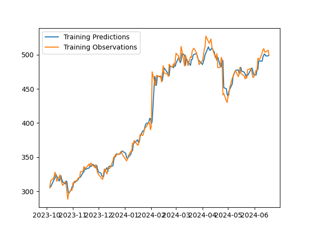
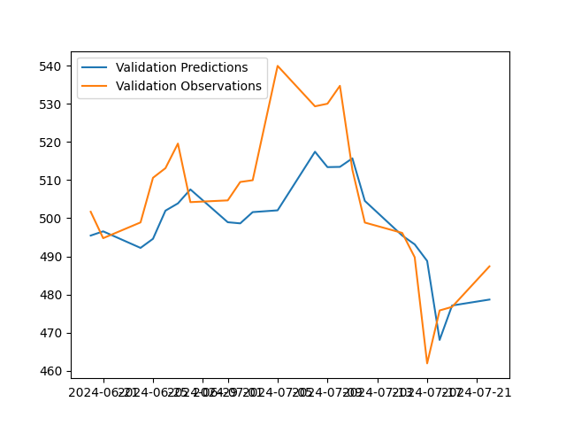
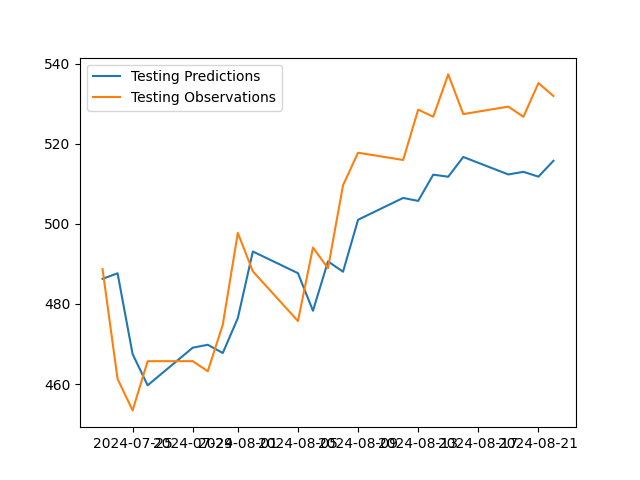
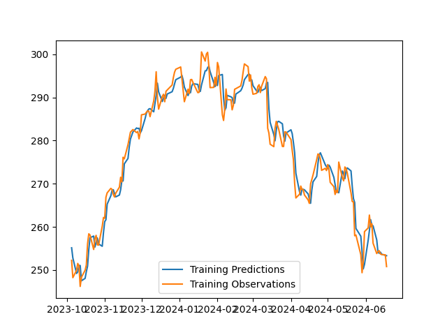
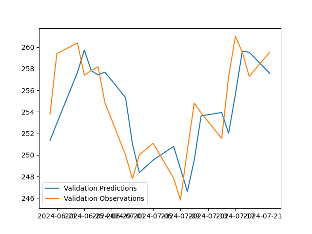
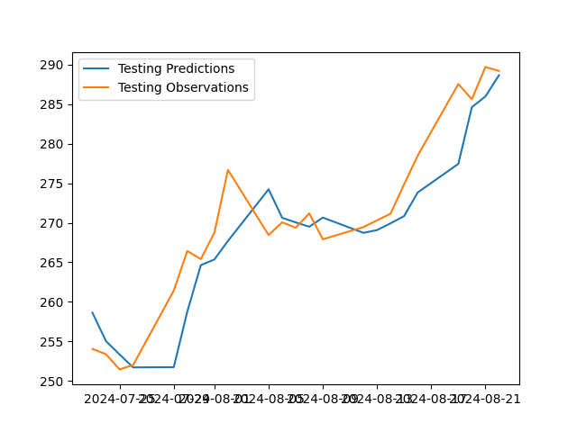

# stock-prediction

**Project Overview**

This project utilized the Tensorflow library to build a simple LSTM-based Sequential model, with an LSTM layer followed by a series of Dense layers, in order to make predictions on a wide stock prices from various companies, such as Netflix, Amazon, Meta, Nvidia, Tesla, and many more. All of the companies used can be found in the datasets folder where a CSV file of the last year's worth of stock data is located. All of these datasets were obtained from Yahoo! Finance. These datasets were then divided into training, validation, and testing data to evaluate the effectiveness of the model in learning the trends from the data. This model takes in the previous 30 days worth of data to make a prediction on the target date. 

The Jupyter notebook used to execute this code is the StockPrediction.ipynb file. In order to automate the process of repeatedly changing the used dataset, I utilized the papermill library and the os library to go through all of the CSVs stored in the datasets folder and repeatedly update the filepath the model was trained on. The outputs depicting the model's effectiveness on the training, validation, and testing data can be found within the outputs directory, where each company has a subfolder with their plots. In order to use this program, all one would have to do is add whatever CSVs they wanted to use to the datasets directory. 

**Sample Outputs**

Here are two examples of the model outputs, with Meta followed by McDonald's.

|  |  |   |
|------------------------|------------------------|------------------------|

|  |  |   |
|------------------------|------------------------|------------------------|